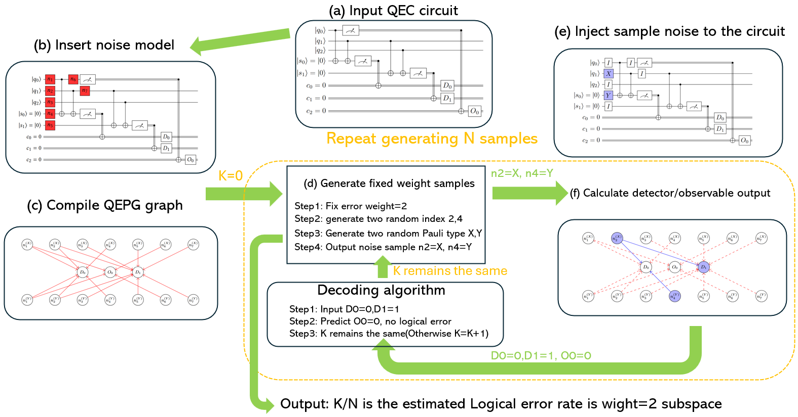
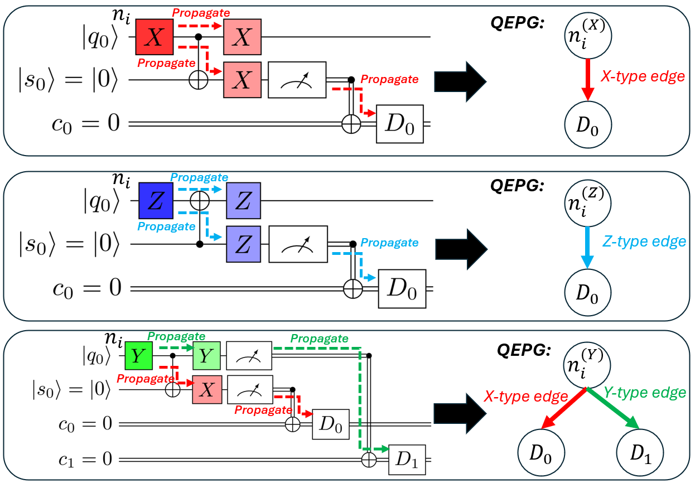

# ScaLERQEC
---

<p align="center">
  
</p>
<p align="center">
  <em>Figure 1: Our logo.</em>
</p> 

ScaLERQEC is a scalable framework for estimating logical error rates (LER) of quantum error-correcting (QEC) circuits at scale.
It combines optimized C++ backends (QEPG) with high-level Python interfaces for QEC experimentation, benchmarking, symbolic analysis, and Monte-Carlo fault injection.
ScaLER is compatible with STIM, but use completely different approach to test logical error rate. 


## Documentation
---

We use Sphinx to automatically generate the documents: 

```bash
py -m sphinx.cmd.build -b html docs/source docs
```

You may visit the current documentation through the following link:

📖 **Documentation website:**  
https://yezhuoyang.github.io/ScaLERQEC/


## 🚀 Installation
---

**🔧 Option 1 — Install via pip (recommended)**

```bash
pip install scalerqec
```

This installs:

* The Python package `scalerqec`,

* The compiled C++ backend `scalerqec.qepg`, and

* All Python modules for LER calculation, sampling, symbolic analysis, etc.

You can then immediately import all modules in Python:

```python
import scalerqec
import scalerqec.qepg
```

**🔧 Option 2 — Install from source**

1. Clone the repository:

```bash
git clone https://github.com/yezhuoyang/ScaLERQEC.git
cd ScaLERQEC
```

2. Build and install:

```bash
pip install .
```

This compiles the C++ backend using pybind11 and places the compiled extension under `scalerqec/qepg.*.so` or `.pyd`


## 📚 Project Structure
---

After installation, the main package structure is:
```bash
scalerqec/
├── qepg               # Compiled QEPG graph and samping method from a C++ backend (by pybind11)
├── Clifford/          # Clifford circuit
├── Monte/             # Monte Carlo sampling method
├── QEC/               # High-level description of quantum error correction circuit 
├── Stratified/        # Stratified fault injection
├── Symbolic/          # Symbolic method
    ...
```

## Construct QEC circuit by Stabilizer
---

A detailed tutorial on using ScaLER to estimate the logical error rate of the surface code is in the notebook `Tutorial.ipynb`. Below is a smaller example of how we construct a code using the stabilizer formalism on the $\llbracket 3, 1, 3 \rrbacket$ $Z$-repetition code.


```python
from scalerqec.QEC.qeccircuit import StabCode
from scalerqec.QEC.noisemodel import NoiseModel

qeccirc= StabCode(n=3,k=1,d=3)

# Stabilizer generators
qeccirc.add_stab("ZZI")
qeccirc.add_stab("IZZ")

# Set the first (and only) logical Z
qeccirc.set_logical_Z(0, "ZZZ")

# Set the noise model with physical error rate
noise_model = NoiseModel(0.001)

# Set stabilizer parity measurement scheme
# We support the Standard, Shor, Knill, and Flag schemes
qeccirc.scheme="Standard"

# Rounds of stabilizer measurements
qeccirc.rounds=2

# Construct IR of the code's circuit
qeccirc.construct_circuit()
```

The last line will convert our stabilizer code to an intermediate representation (IR) that is much easier to debug. One can see the IR by calling the following:

```python
qeccirc.show_IR()
```

Which outputs (for the above circuit):

```bash
c0 = Prop[r=0, s=0] ZZI
c1 = Prop[r=0, s=1] IZZ
c2 = Prop[r=1, s=0] ZZI
d0 = Parity c0 c2
c3 = Prop[r=1, s=1] IZZ
d1 = Parity c1 c3
c4 = Prop ZZZ
o0 = Parity c4
```

* `cX = Prop[r, s] str`: The `X`th stabilizer check during syndrome extraction round `r` corresponding to stabilizer `s`, with string representation `str`.
* `dX = Parity cY cZ`: The `X`th detector is the parity of checks `Y` and `Z`
* `oX = Parity cY`: The `X`th detector is the exact same result as check `Y`.

# LogiQ - A high-level, fault-tolerant quantum programming language
---

We introduce LogiQ -- which supports users to define their own logical QEC block and implement logical Clifford+T operations.

```python
Type surface:
    The stabilizers should be a function of d
    This type describe the stabilizer structure.

surface q1 [n1,k1,d1]   # The first block of the surface code
surface q2 [n2,k2,d2]   # The second block of the surface code
surface t0 [n3,k3,d3]   # Magic T state block

q1[0] = LogicH q1[0]

t0 = Distill15to1_T[d=25]     # returns a magic_T handle (see MagicQ below)
InjectT q1[0], t0

q2[1] = LogicCNOT q1[0], q2[1]

c1 = LogicMeasure q1[0]
c2 = LogicMeasure q2[1]
```

# MagicQ - A high level fault-tolerant quantum programming for dynamic protocol with Post-selection
---

We introduce MagicQ -- which allows the user to construct a magic state factory. MagicQ also has the full power to express all code-switching protocols.

```python
protocol Distill15to1_T(surface f, int d):
  Repeat:

      # ---- X-type stabilizer checks ----
      c_x1 = LogicProp IIIIIIIXXXXXXXX
      c_x2 = LogicProp IIIXXXXIIIIXXXX
      c_x3 = LogicProp IXXIIXXIIXXIIXX
      c_x4 = LogicProp XIXIXIXIXIXIXIX

      # ---- Z-type stabilizer checks ----
      c_z1  = LogicProp IIIIIIIIZZZZZZZZ
      c_z2  = LogicProp IIIZZZZIIIIZZZZ
      c_z3  = LogicProp IZZIIZZIIZZIIZZ
      c_z4  = LogicProp ZIZIZIZIZIZIZIZ
      c_z12 = LogicProp IIIIIIIIIIZZZZ
      c_z13 = LogicProp IIIIIIIIZZIIIZZ
      c_z14 = LogicProp IIIIIIIIZIZIZIZ
      c_z23 = LogicProp IIIIIZZIIIIIIZZ
      c_z24 = LogicProp IIIIZIZIIIIIZIZ
      c_z34 = LogicProp IIZIIIZIIIZIIIZ

      Success = c_x1 == 0 && c_x2 == 0 && c_x3 == 0 && c_x4 == 0 &&
                c_z1 == 0 && c_z2 == 0 && c_z3 == 0 && c_z4 == 0 &&
                c_z12 == 0 && c_z13 == 0 && c_z14 == 0 &&
                c_z23 == 0 && c_z24 == 0 && c_z34 == 0
      Until Success

      return
```

## How ScaLER works
---

**Main method**

ScaLERQEC estimates the LER by stratified fault-sampling and curve fitting:

<p align="center">
  
</p>
<p align="center">
  <em>Figure 2: Diagram for the main method in ScaLERQEC.</em>
</p> 


We propose a novel method which tests the logical error rate by stratified sampling and curve fitting. See the tutorial for a detailed explanation. With a fixed QEC circuit and the noise model, we provide a simple interface for this method.

```python
from scalerqec.Stratified import StratifiedScurveLERcalc
calculator = StratifiedScurveLERcalc()
figname = "Repetition"  
titlename = "Repetition" 
stratifiedcalculator.calculate_LER_from_StabCode(qeccirc, noise_model, figname , titlename, repeat=3)
```

which outputs:
|  |  |
|:---------------------------------------------------------------------:|:----------------------------------------------------------------------------:|
| *Figure 1: Subspace error rate in the log space* | *Figure 2: Same, but plot in original space* |

**Using the C++ QEPG Backend from Python**

The QEPG is a model of how errors in certain locations can propagate to flip STIM detector outcomes.

<p align="center">
  
</p>
<p align="center">
  <em>Figure 2: Illustration of how we compile a QEPG graph in ScaLERQEC.</em>
</p> 

To do the above curve-fitting, ScaLERQEC compiles any STIM circuit to QEPG graph.

```python
import scalerqec.qepg as qepg
graph = qepg.compile_QEPG(open("circuit.stim").read())
samples = qepg.return_samples_with_fixed_QEPG(graph, weight=3, shots=10_000)
print(samples)
```

**Running Monte-Carlo Fault-Injection**

We support the standard Monte-Carlo testing through the following interface:

```python
from scalerqec.Monte.monteLER import MonteLERcalc
montecalculator = MonteLERcalc()
symbcalculator.calculate_LER_from_StabCode(qeccirc, noise_model)
```

**Running Symbolic LER Analysis (Ground Truth)**

ScaLERQEC has an additional novel method which calculates the exact symbolic polynomial representation of the logical error rate of a given QEC circuit under a uniform noise model.

```python
from scalerqec.Symbolic.symbolicLER import SymbolicLERcalc
symbcalculator = SymbolicLERcalc()
symbcalculator.calculate_LER_from_StabCode(qeccirc, noise_model)
```

# 📌 TODO (Roadmap)
---

- [x] Support installation via `pip install`
- [x] Higher-level, easier interface to generate QEC program
- [x] Add cross-platform installation support (including macOS)
- [x] Python interface to construct QEC circuit
- [x] Write full documentation
- [ ] Support LDPC codes and LDPC code decoders
- [ ] Get rid of Boost package, use binary representation
- [ ] Add CUDA backend support and compare with STIM
- [ ] SIMD support and compare with STIM
- [ ] Constructing and testing magic state distillation/Cultivation
- [ ] Compatible with Qiskit
- [ ] Visualize results better and visualize QEPG graph
- [ ] HotSpot analysis (What is the reason for logical error?)
- [ ] Implement dynamic-circuit support (Compatible with IBM)
- [ ] Support testing code switching such as lattice surgery, LDPC code switching protocol
- [ ] Add more realistic noise models (Decoherence noise, Correlated noise)
- [ ] Support injecting quantum errors by type (Hook Error, Gate error, Propagated error, etc)
- [ ] Static analysis pass of circuit (Learn symmetric structure)
- [ ] Test Pauli measurement based fault-tolerant circuit 

# 🧰 Development Notes (for contributors)
---

## 1. Installation (Development Only)

At the moment, ScaLERQEC is installed **from source**. 

### 1.1. Prerequisites

Common to all platforms:

- Python ≥ 3.9 (3.11+ recommended)
- A C++20-compatible compiler
- `pip` and a virtual environment (`venv`, `conda`, etc.)

Additional dependencies:

- **Boost** (for `boost::dynamic_bitset`)
- **pybind11** (handled automatically as a build dependency, but the C++ compiler must be able to see its headers)


#### Windows (MSVC)

1. Install [Visual Studio Build Tools] or full Visual Studio with C++ toolchain.
2. Install Boost (MSVC flavor), e.g. via Chocolatey:

```bash
choco install boost-msvc-14.3 -y
``` 

The boost header file will be stored under the path "C:\local\boost_1_87_0\boost". Add this path into VScode cpp include path in your development process. 

We use pybind11 to convert the samples from C++ objects to python objects. To install using vcpkg, run the following command:

```bash
vcpkg install pybind11
```


#### macOS (Apple Silicon / Intel)

Install Xcode command-line tools:

```bash
xcode-select --install
```

Install Homebrew (if you don’t have it):

```bash
/bin/bash -c "$(curl -fsSL https://raw.githubusercontent.com/Homebrew/install/HEAD/install.sh)"
``` 

Install pybind11 via Homebrew:

```bash
brew install pybind11 boost
``` 

This provides headers in:

/opt/homebrew/include (ARM)
/usr/local/include (Intel)


#### Linux (Ubuntu / Debian-like)

Roughly:

```bash
sudo apt install libboost-dev
pip install pybind11
```

Boost headers go into /usr/include/boost.


## Locating Python headers


Also need to add the path of the python header file

```bash
py -c "from sysconfig import get_paths as gp; print(gp()['include'])"
```

## Building the C++ QEPG backend


Run the following command to build the QEPG package with pybinding:

```bash
py setup.py build_ext --inplace
```

Run the following command to clear the previously compiled output:

```bash
py setup.py clean --all    
```


We also need to convert C++ object to python object directly. So "Python.h" needs to be added to the search path. Typically, it is under:


```bash
C:\Users\username\miniconda3\include
```


# How to compile and run python scripts


To compile QEPG python package by pybind11:

```bash
(Under QEPG folder)./compilepybind.ps1
```

The python code is divided into different modules. For example, to run the test_by_stim.py file under test module, stay at the root folder and execute:

```bash
(Under Sampling folder)py -m test.test_by_stim   
```

