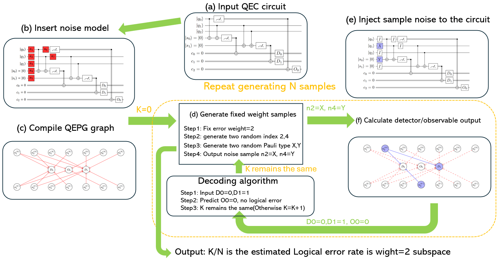
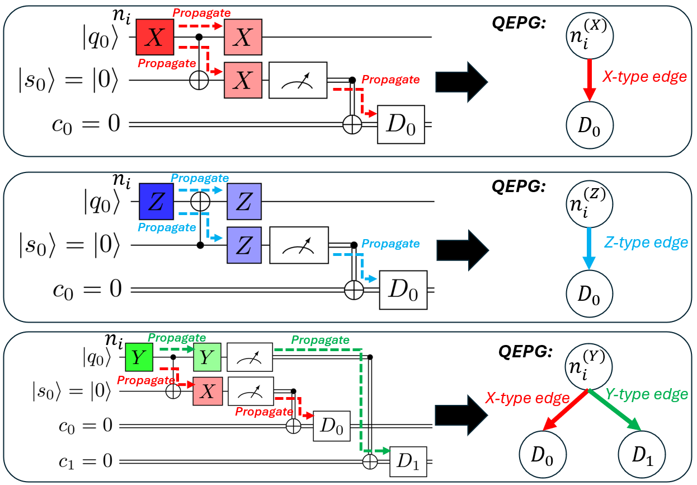

# ScaLERQEC
---

<p align="center">
  
</p>
<p align="center">
  <em>Figure 1: Our logo.</em>
</p>

ScaLERQEC is a scalable framework for estimating logical error rates (LER) of quantum error-correcting (QEC) circuits at scale.
It combines an optimized C++ backend (QEPG with SIMD acceleration and OpenMP parallelism) with high-level Python interfaces for QEC experimentation, benchmarking, symbolic analysis, and Monte Carlo fault injection.

ScaLERQEC is compatible with [Stim](https://github.com/quantumlib/Stim) circuits.
Its original method combines **stratified fault sampling with S-curve fitting**.
The development version also supports **gate-dependent Pauli noise controlled by
one parameter p**, with reusable weighted profiles, polynomials, and statistical
error bars.

## Citation
---

If you use ScaLERQEC in your research, please cite our paper:

```bibtex
@misc{ye2026scalabletestingquantumerror,
      title={Scalable testing of quantum error correction},
      author={John Zhuoyang Ye and Jens Palsberg},
      year={2026},
      eprint={2602.04921},
      archivePrefix={arXiv},
      primaryClass={quant-ph},
      url={https://arxiv.org/abs/2602.04921},
}
```

## Documentation
---

We use Sphinx to automatically generate the documents:

```bash
python -m sphinx.cmd.build -b html docs/source docs
```

You may visit the current documentation through the following link:

**Documentation website:**
https://yezhuoyang.github.io/ScaLERQEC/


## Installation
---

Use a **source installation** for the new general-noise profiling APIs below.
The published package may lag behind this development checkout.

### Option 1 -- Install via pip

```bash
pip install scalerqec
```

This installs:

* The Python package `scalerqec`
* The compiled C++ QEPG backend (`scalerqec.qepg`) with SIMD and OpenMP support
* All Python modules for LER calculation, sampling, symbolic analysis, etc.

You can then immediately import all modules in Python:

```python
import scalerqec
import scalerqec.qepg
```

### Option 2 -- Install from source

1. Clone the repository:

```bash
git clone https://github.com/yezhuoyang/ScaLERQEC.git
cd ScaLERQEC
```

2. Build and install:

```bash
pip install -e .
```

This compiles the C++ backend using pybind11 and installs the package in development mode.
For BP+OSD decoding, use `pip install -e ".[ldpc]"`.

### Prerequisites

**All platforms:**
- Python >= 3.10
- A C++20-compatible compiler

**No external C++ libraries required.** The C++ backend is self-contained -- Boost has been removed. All dependencies (pybind11, stim, pymatching, etc.) are handled automatically by pip.

**Platform-specific notes:**

| Platform | Compiler | OpenMP |
|----------|----------|--------|
| **Windows** | MSVC (Visual Studio Build Tools) | Built-in (`/openmp`) |
| **macOS** | Xcode command-line tools | `brew install libomp` |
| **Linux** | GCC or Clang | Built-in (`-fopenmp`) |


## Project Structure
---

```
scalerqec/
├── qepg                # C++ QEPG backend with SIMD acceleration (via pybind11)
├── Analysis/           # Hotspot analysis and visualization
├── Clifford/           # Clifford circuit representation, STIM parser, Python QEPG
├── Monte/              # Monte Carlo LER estimation (standard + LDPC codes)
├── QEC/                # High-level QEC circuit construction from stabilizers
├── Stratified/         # SID S-curves, general-noise profiles, and polynomials
│   └── models/         # Pluggable S-curve models and factory
├── Symbolic/           # Exact SID polynomials for small circuits
└── util/               # Binomial utilities, Pauli helpers, output formatting
```

**Bundled Stim circuits** (under `stimprograms/`):

| Code family | Subdirectory | Distances available |
|-------------|--------------|-------------------|
| Surface code | `surface/` | d = 3, 5, 7, 9, 11, 13, 15, 17, 19, 21, 23, 25, 27, 30 |
| Repetition code | `repetition/` | d = 3, 5, 7, ..., 29 |
| Color code | `color/` | d = 3, 5, 7, 9, 11, 13, 15 |
| Toric code | `toric/` | d = 3, 5, 7, 9, 11, 13, 15 |
| Hexagonal code | `hexagon/` | d = 3, 5, 7, ..., 25 |
| Square code | `square/` | d = 3, 5, 7, ..., 25 |
| BB LDPC codes | `ldpc/` | [[72,12,6]], [[90,8,10]], [[108,8,8]], [[144,12,12]], [[288,16,18]] |

`stimprograms/small/` contains tiny circuits for symbolic analysis and tests.


## Quick Start
---

### Gate-dependent noise: weighted profiles, polynomials, and error bars

Use `LinearNoiseModel` for supported stochastic Pauli channels whose noise
arguments scale as `c*p`. This includes `DEPOLARIZE1/2`, biased Pauli channels,
correlated/ELSE errors, heralded errors, and measurement flips. For example,
`DEPOLARIZE2(p)` assigns probability `p/15` to XX: a weight-2 fault at one
location can occur with probability proportional to p.

Construct a numeric Stim circuit at `p_ref`; each noise argument q then scales
as `(q/p_ref)*p`. This example uses **one-qubit noise p/5, two-qubit noise p,
and measurement noise 5p**, with ideal reset and idle operations:

```python
import matplotlib.pyplot as plt
import numpy as np
import pymatching
import stim
from scalerqec.QEC.noisemodel import NoiseModel
from scalerqec.Stratified import LinearNoiseModel, LERPolynomial

p_ref = 0.001
ideal = stim.Circuit.generated(
    "surface_code:rotated_memory_z", distance=3, rounds=3,
)
noise = NoiseModel(
    p_ref, p_1q=p_ref / 5, p_2q=p_ref,
    p_meas=5 * p_ref, p_reset=0, p_idle=0,
)
model = LinearNoiseModel(noise.apply(ideal), reference_p=p_ref)
decoder = pymatching.Matching.from_detector_error_model(
    model.circuit.detector_error_model(decompose_errors=True),
)
ps = np.array([0.0001, 0.0003, 0.001])
result = model.sample_bernstein_profile(
    decoder, ps, relative_error=0.2, confidence=0.99,
    max_shots=1_000_000, max_seconds=60, seed=123,
)
print(result.status, result.reason)

# Weighted profile: auxiliary trial count T, Pauli weight W, shots, failures.
np.savetxt(
    "weighted_profile.csv", np.asarray(result.joint_counts).reshape(-1, 4),
    fmt="%d", delimiter=",", header="T,W,shots,failures", comments="",
)

# Plot the estimates and their simultaneous confidence intervals.
fig, ax = plt.subplots()
ax.vlines(ps, [e.lower for e in result.estimates],
          [e.upper for e in result.estimates], label="99% confidence intervals")
ax.plot(ps, [e.ler for e in result.estimates], "o", label="Estimated LER")
ax.set(xscale="log", xlabel="Physical noise parameter p",
       ylabel="Logical error probability", title=result.status)
ax.set_ylim(bottom=0)
ax.legend()
fig.savefig("ler-vs-p.png", bbox_inches="tight")
plt.close(fig)

if result.converged:
    polynomial = result.to_polynomial()
    polynomial.save("ler_polynomial.npz")
    restored = LERPolynomial.load("ler_polynomial.npz")
    print(restored(ps))                  # No new sampling or decoding.
    print(result.estimates)             # Keep the requested-grid error bars.
    print(restored.to_sympy())           # Factored polynomial in p.
    # For small polynomials: restored.to_sympy(expanded=True).
```

Keep the circuit, gate-rate ratios and decoder fixed, and evaluate only within
`0 <= p <= model.max_p` (0.2 here). To use your own circuit, pass
`stim.Circuit.from_file(...)`; for StabIR, attach `code.noisemodel = noise` and
call `LinearNoiseModel.from_stabcode(code, reference_p=p_ref)`.

Pauli weight counts factors at their original locations: XI has weight 1 and
XX has weight 2; native record flips have weight 0. General noise needs the
additional trial/likelihood information because physical weight alone does
not determine a p-independent failure rate. `result.weight_polynomial(w)`
exports the contribution `P(failure AND W=w)` without per-weight error bars.
For direct allocation by weight and saved `GeneralNoiseProfile` objects, see
[the general-noise guide](docs/general_noise_usage.md).

**Current limits:** The original S-curve method still has systematic
extrapolation error. The general-noise polynomial avoids that fit, but its
coefficients are sampled; statistical bounds do not cover hardware-model
mismatch. A `budget_exhausted` run has not met every precision target; error bars
apply to the requested p values, not the whole polynomial. Rare-event efficiency remains
unresolved. Support is for one-parameter linear Pauli-noise families, not
arbitrary coherent or non-Markovian noise. See the
[method and confidence bounds](docs/uniformized_profiling.md) and
[gate-dependent examples](docs/gate_scaled_noise_example.md).

### Sample once, plot LER versus p (original SID method)

New in **1.1.0**: reuse a fixed circuit-and-decoder profile across physical error
probabilities. The expensive sampling and fitting run only once:

```python
import numpy as np
from scalerqec.Stratified import Scaler, LERProfile

profile = Scaler(time_budget=60).profile_from_file(
    "stimprograms/surface/surface3", codedistance=3,
    decoder_reference_p=0.001,
)
profile.save("surface3-profile.json")

p_values = np.geomspace(1e-5, 0.02, 100)
logical_error_rates = profile.evaluate(p_values)
ax = profile.plot(p_values)
ax.figure.savefig("ler-vs-p.pdf", bbox_inches="tight")

# Reuse in a later session without sampling or decoding.
profile = LERProfile.load("surface3-profile.json")
print(profile.evaluate(0.0005))
```

This interface requires a **noiseless Stim circuit**, one logical observable,
and the paper's **uniform independent single-qubit depolarizing (SID) model**.
The decoder is fixed at `decoder_reference_p`; it is not rebuilt for each p.
`codedistance` must be the circuit-level distance for that circuit and decoder.

Use `profile.curve(p_values)` to inspect contributions from fitted weights, and
`profile.sample_counts` / `failure_counts` to inspect the measured evidence.
These diagnostics are not confidence intervals. See the
[profile guide](docs/source/profiles.rst) for the precise assumptions and API.
After an existing `calculate_LER_from_file()` run, use `scaler.get_profile()`.

### 1. Define a QEC code with StabIR

StabIR is our stabilizer-level intermediate representation. You define the **code structure** (stabilizers, logical operators, measurement scheme, rounds) independently of any noise model. The IR is then compiled into a noiseless Stim circuit.

A detailed tutorial is available in `Tutorial.ipynb`. Below is a smaller example using the [[3, 1, 3]] Z-repetition code.

```python
from scalerqec.QEC.qeccircuit import StabCode

# Step 1: Define the code structure
qeccirc = StabCode(n=3, k=1, d=3)
qeccirc.add_stab("ZZI")          # stabilizer generators
qeccirc.add_stab("IZZ")
qeccirc.set_logical_Z(0, "ZZZ")  # logical Z operator

# Step 2: Configure the measurement scheme
qeccirc.scheme = "Standard"       # also supports: Shor, Knill, Flag
qeccirc.rounds = 2

# Step 3: Compile to a noiseless Stim circuit
qeccirc.construct_circuit()

# The compiled circuit is available as a stim.Circuit object
print(qeccirc.stimcirc)
```

You can inspect the intermediate representation:

```python
qeccirc.show_IR()
```

Output:
```
c0 = Prop[r=0, s=0] ZZI
c1 = Prop[r=0, s=1] IZZ
c2 = Prop[r=1, s=0] ZZI
d0 = Parity c0 c2
c3 = Prop[r=1, s=1] IZZ
d1 = Parity c1 c3
c4 = Prop ZZZ
o0 = Parity c4
```

Once compiled, you can combine the code with a supported noise model to estimate the logical error rate. The noise model is applied **separately** -- it is not part of the code definition:

```python
from scalerqec.QEC.noisemodel import NoiseModel, SD6NoiseModel, SI1000NoiseModel

# Option A: Simple depolarizing noise
noise_model = NoiseModel(0.001)

# Option B: Standard depolarizing (6 noise locations per round)
noise_model = SD6NoiseModel(0.001)

# Option C: Superconducting-inspired noise
noise_model = SI1000NoiseModel(0.001)

# Estimate LER with Monte Carlo
from scalerqec.Monte import MonteLERcalc

mc = MonteLERcalc(time_budget=30, samplebudget=500000, MIN_NUM_LE_EVENT=50)
ler = mc.calculate_LER_from_stim_circuit(
    str(noise_model.apply(qeccirc.stimcirc)), samplebudget=500000,
)
print(f"LER = {ler:.2e}")
```

For general-noise profiles, attach the noise model and use
`LinearNoiseModel.from_stabcode`. The original ScaLER and exact symbolic
calculators retain their SID restrictions. Calculators accept custom decoders
via `decoder=my_decoder`; the general profiler takes the decoder as an argument.


### 2. ScaLER -- Time-budgeted S-curve LER estimation (main method)

ScaLERQEC estimates the LER by stratified fault sampling and S-curve fitting. The `Scaler` class runs a three-phase adaptive algorithm within a wall-clock time budget:

1. **Phase 1 (Initialization):** Binary search for error-onset and saturation weights, fit an initial S-curve.
2. **Phase 2 (Sweet-spot exploration):** Uniformly sample weights near the theoretical sweet spot.
3. **Phase 3 (Adaptive refinement):** Iteratively add samples at weights needing more logical error events.

<p align="center">
  
</p>
<p align="center">
  <em>Figure 2: Diagram for the main method in ScaLERQEC.</em>
</p>

**From a Stim circuit file (recommended):**

```python
from scalerqec.Stratified import Scaler, ModelType

scaler = Scaler(
    error_rate=0.001,
    time_budget=120,               # wall-clock seconds
    model_type=ModelType.OUR_MODEL,
    gamma=1,
    num_subspaces_phase2=12,
)

ler = scaler.calculate_LER_from_file(
    filepath="stimprograms/surface/surface7",
    pvalue=0.001,
    codedistance=7,
    figname="Figures/Surface7_ScaLER",
    titlename="Surface Code d=7",
)

print(f"LER: {ler:.6e}")
print(f"R²: {scaler._model.r_squared:.4f}")
print(f"Sweet spot: {scaler._sweet_spot}")
print(f"Total samples: {sum(scaler._subspace_sample_used.values()):,}")
```

Output:
|  |  |
|:---------------------------------------------------------------------:|:----------------------------------------------------------------------------:|
| *Figure 3: Subspace error rate in log-logit space* | *Figure 4: Fitted S-curve in probability space* |


### 3. ScaLER for LDPC codes

For LDPC codes (e.g., BB codes), use `ScalerLDPC` which integrates a belief-propagation + OSD decoder:

```python
from scalerqec.Stratified.ScalerLDPC import ScalerLDPC

calculator = ScalerLDPC(
    error_rate=0.001,
    time_budget=60,          # seconds
    max_bp_iters=20,
    osd_order=0,
)
calculator.calculate_LER_from_file(
    filepath="stimprograms/ldpc/bbcode_72_12_6_rounds18",
    pvalue=0.001,
    codedistance=6,
    figname="BBCode",
    titlename="BB Code [[72,12,6]]",
)
```


### 4. Monte Carlo LER estimation

Standard Monte Carlo fault injection with adaptive batching. All calculators accept an optional `decoder` parameter -- any object with a `decode_batch()` method (pymatching, BPOSD, or your own). If omitted, pymatching is used by default. See Section 1 above for applying a noise model to a compiled StabCode.

**From a Stim circuit file (uniform noise):**

```python
mc = MonteLERcalc(time_budget=30, samplebudget=500000)
ler = mc.calculate_LER_from_file(
    samplebudget=500000,
    filepath="stimprograms/surface/surface7",
    pvalue=0.001,
)
print(f"LER = {ler:.2e}")
```

**From a Stim circuit string (non-uniform noise):**

ScaLERQEC supports circuits with mixed noise types (DEPOLARIZE1 at varying rates, X_ERROR, Y_ERROR, Z_ERROR, DEPOLARIZE2):

```python
mc = MonteLERcalc(time_budget=30, samplebudget=500000)
stim_str = open("my_noisy_circuit.stim").read()
ler = mc.calculate_LER_from_stim_circuit(stim_str)
print(f"LER = {ler:.2e}")
```

**Monte Carlo for LDPC codes:**

```python
from scalerqec.Monte import MonteLDPC

mc_ldpc = MonteLDPC(time_budget=60, samplebudget=100000, max_bp_iters=20)
ler = mc_ldpc.calculate_LER_from_file(
    samplebudget=100000,
    filepath="stimprograms/ldpc/bbcode_72_12_6_rounds18",
    pvalue=0.001,
)
```


### 5. Symbolic LER analysis (exact ground truth)

ScaLERQEC can compute **exact symbolic LER polynomials** for small SID circuits (at most 32 noise locations):

```python
from scalerqec.Symbolic import SymbolicLERcalc

sym = SymbolicLERcalc()
exact_ler = sym.calculate_LER_from_file(
    filepath="stimprograms/small/simple",
    pvalue=0.001,
)
print(f"Exact LER = {exact_ler:.6e}")
```

This is useful for validating Monte Carlo and ScaLER estimates on small circuits.


### 6. Hotspot analysis -- identify dominant error sources

ScaLERQEC includes a **decoder-agnostic hotspot analysis** module that reveals which noise categories contribute most to logical failures. It uses a three-phase C++-accelerated pipeline:

1. **C++ labeled sampling**: sample noise via QEPG with per-shot category bitmask tracking (near-zero overhead).
2. **User's decoder**: decode detector outcomes with any decoder (pymatching, BPOSD, custom).
3. **C++ aggregation**: compute P(category fired | logical error), lift, and multi-error configuration breakdown.

The noise label system classifies each DEPOLARIZE1 source into one of four QStab IR error types using positional classification (relative to the CX schedule):

| Type | Name | Description |
|------|------|-------------|
| 0 | `data_qubit_error` | Data qubit error before/after CX phase |
| I | `ghost_error` | Data qubit error during CX phase with future CX |
| II | `hook_error` | Ancilla error with remaining CX (back-propagation) |
| III | `measurement_error` | Ancilla error after last CX |

```python
import numpy as np
import pymatching
from scalerqec.Analysis.hotspot import HotspotAnalyzer
from scalerqec.Clifford.stimparser import rewrite_stim_code
from scalerqec.QEC.noisemodel import SIDNoiseModel
from scalerqec import qepg as qepg_cpp

# Use the three-data-qubit StabCode defined above.
p = 0.001
stim_circuit = SIDNoiseModel(p).apply(qeccirc.stimcirc)
matcher = pymatching.Matching.from_detector_error_model(
    stim_circuit.detector_error_model(decompose_errors=True),
)
prog_str = rewrite_stim_code(str(stim_circuit), keep_noise=True)
graph = qepg_cpp.compile_QEPG(prog_str)
cc_cpp = qepg_cpp.CliffordCircuit()
cc_cpp.compile_from_rewrited_stim_string(prog_str)
label_map = qepg_cpp.auto_label(cc_cpp, 3)
noise_probs = np.full((graph.get_total_noise(), 3), p / 3)

# Run hotspot analysis with your chosen decoder
analyzer = HotspotAnalyzer(graph, label_map, decoder=matcher)
result = analyzer.analyze(noise_probs, num_shots=1_000_000)
analyzer.print_report(result)
```

Output:
```
======================================================================
  Hotspot Analysis  (613 logical errors, LER = 0.000613, 1000000 shots)
======================================================================
  Category                  Count   P(fire)  P(fire|err)  P(err|fire)    Lift
  ------------------------- -----  --------  -----------  -----------  ------
  data_qubit_error              4    0.0200       0.3622       0.0111   18.10
  ghost_error                  11    0.0534       0.9494       0.0109   17.77
  measurement_error             2    0.0101       0.0326       0.0020    3.23
  hook_error                   16    0.0772       0.1974       0.0016    2.56
======================================================================
```


### 7. Using the C++ QEPG backend directly

The QEPG (Quantum Error Propagation Graph) is a binary model of how errors propagate to flip detector outcomes.

<p align="center">
  
</p>
<p align="center">
  <em>Figure 5: Illustration of how we compile a QEPG graph in ScaLERQEC.</em>
</p>

```python
import scalerqec.qepg as qepg

# Compile a Stim circuit into a reusable QEPG graph
stim_str = open("stimprograms/surface/surface7").read()
graph = qepg.compile_QEPG(stim_str)

# Sample at fixed error weight (stratified sampling)
det_outcomes, obs_outcomes = qepg.return_samples_many_weights_separate_obs_with_QEPG(
    graph,
    weight=[3, 5, 7],
    shots=[10000, 10000, 10000],
)

# Monte Carlo sampling at a given error rate
det, obs = qepg.return_samples_Monte_separate_obs_with_QEPG(
    graph, error_rate=0.001, shot=100000
)

# Non-uniform noise sampling (per-source probabilities)
import numpy as np
from scalerqec.Monte.noise_model_parser import extract_noise_model

noise_model = extract_noise_model(stim_str)
det, obs = qepg.return_samples_nonuniform_to_numpy(
    graph,
    noise_model.noise_probs,
    np.array([p.source_a for p in noise_model.correlated_pairs], dtype=np.int64),
    np.array([p.source_b for p in noise_model.correlated_pairs], dtype=np.int64),
    np.array([p.prob for p in noise_model.correlated_pairs], dtype=np.float64),
    shot=100000,
)
```


# LogiQ -- A high-level, fault-tolerant quantum programming language
---

LogiQ describes logical QEC blocks and Clifford+T operations. The language
example below illustrates the design; arbitrary adaptive programs do not yet
have a complete physical LER backend.

```text
# 1) Define a family of surface codes (sugar -> CSSCode core)
code surface(d: Int) as CellComplex over Z2 {

  cells {
    faces     F[x,y]  in 0..(d-2), 0..(d-2);
    edges_x   Ex[x,y] in 0..(d-2), 0..(d-1);
    edges_y   Ey[x,y] in 0..(d-1), 0..(d-2);
    vertices  V[x,y]  in 0..(d-1), 0..(d-1);
  }

  boundary {
    d2(F[x,y]) =
      Ex[x,y]   +
      Ey[x+1,y] +
      Ex[x,y+1] +
      Ey[x,y];

    d1(Ex[x,y]) = V[x,y]   + V[x+1,y];
    d1(Ey[x,y]) = V[x,y]   + V[x,y+1];
  }

  css {
    hx = matrix(d2);
    hz = transpose(matrix(d1));
  }
}

code five_qubit as StabilizerCode {

  # Number of physical qubits (optional if implied by generator length)
  n = 5;

  generators {
    S0 = "XZZXI";
    S1 = "IXZZX";
    S2 = "XIXZZ";
    S3 = "ZXIXZ";
  }

  logical_z {
    LZ0 = "ZZZZZ";
  }
}


surface q1 [n=40, k=1, d=5]   # First surface-code block (distance-5)
surface q2 [n=40, k=1, d=5]   # Second surface-code block (distance-5)
surface t0 [n=84, k=1, d=7]   # Magic-T ancilla block (distance-7)

q1[0] = LogicH q1[0]

t0 = Distill15to1_T[d=25]     # returns a magic_T handle (see MagicQ below)
InjectT q1[0], t0

q2[1] = LogicCNOT q1[0], q2[1]

c1 = LogicMeasure q1[0]
c2 = LogicMeasure q2[1]
```

# MagicQ -- A high level fault-tolerant quantum programming for dynamic protocol with Post-selection
---

MagicQ describes dynamic protocols such as magic-state factories and code
switching. Postselection and retry remain planned LER-backend work.

```text
protocol Distill15to1_T(surface f, int d):
  Repeat:

      # ---- X-type stabilizer checks ----
      c_x1 = LogicProp IIIIIIIXXXXXXXX
      c_x2 = LogicProp IIIXXXXIIIIXXXX
      c_x3 = LogicProp IXXIIXXIIXXIIXX
      c_x4 = LogicProp XIXIXIXIXIXIXIX

      # ---- Z-type stabilizer checks ----
      c_z1  = LogicProp IIIIIIIIZZZZZZZZ
      c_z2  = LogicProp IIIZZZZIIIIZZZZ
      c_z3  = LogicProp IZZIIZZIIZZIIZZ
      c_z4  = LogicProp ZIZIZIZIZIZIZIZ
      c_z12 = LogicProp IIIIIIIIIIZZZZ
      c_z13 = LogicProp IIIIIIIIZZIIIZZ
      c_z14 = LogicProp IIIIIIIIZIZIZIZ
      c_z23 = LogicProp IIIIIZZIIIIIIZZ
      c_z24 = LogicProp IIIIZIZIIIIIZIZ
      c_z34 = LogicProp IIZIIIZIIIZIIIZ

      Success = c_x1 == 0 && c_x2 == 0 && c_x3 == 0 && c_x4 == 0 &&
                c_z1 == 0 && c_z2 == 0 && c_z3 == 0 && c_z4 == 0 &&
                c_z12 == 0 && c_z13 == 0 && c_z14 == 0 &&
                c_z23 == 0 && c_z24 == 0 && c_z34 == 0
      Until Success

      return
```

## Performance: QEPG Sampling vs Stim
---

The following recorded benchmarks compare QEPG and Stim detector sampling.
QEPG compiles fault responses once and combines the active responses per shot.
These timings exclude decoding and predate the general-noise profiler; they
are sampling-throughput results, not end-to-end LER accuracy benchmarks.

Two QEPG sampling modes are available:

- **QEPG Monte Carlo**: The current backend uses exact sparse Bernoulli sampling via geometric skips, where k ~ Np is the expected number of faults.
- **QEPG Fixed-Weight**: Injects exactly *w* faults per shot (used by ScaLER stratified estimation). Cost is O(weight) per sample via Floyd's algorithm.

Both modes use a fused sampling pipeline that writes directly into NumPy buffers with zero intermediate allocation, SIMD-accelerated XOR accumulation, and OpenMP parallelism.

**Single-threaded comparison (OMP_NUM_THREADS=1, 100K shots, p=0.001)**

Stim's detector sampler is single-threaded with excellent SIMD optimization. For a fair apples-to-apples comparison, we benchmark with OpenMP disabled:

| Code | Stim (M/s) | QEPG MC (M/s) | MC Speedup | QEPG FW (M/s) | FW Speedup |
|------|----------:|---------------:|-----------:|---------------:|-----------:|
| d=3  | 6.84      | 20.8           | **3x**     | 27.5           | **4x**     |
| d=5  | 0.83      | 7.3            | **9x**     | 8.2            | **10x**    |
| d=7  | 0.30      | 2.5            | **8x**     | 3.0            | **10x**    |
| d=9  | 0.22      | 0.9            | **4x**     | 1.2            | **6x**     |
| d=11 | 0.08      | 0.3            | **4x**     | 0.6            | **7x**     |

Actual throughput depends on circuit structure, noise rate, backend version and hardware.

**Multi-threaded comparison (32 cores, 100K shots, p=0.001)**

With OpenMP enabled, QEPG parallelizes across shots:

| Code | Stim (M/s) | QEPG MC (M/s) | MC Speedup | QEPG FW (M/s) | FW Speedup |
|------|----------:|---------------:|-----------:|---------------:|-----------:|
| d=3  | 7.29      | 79.9           | **11x**    | 47.3           | **6x**     |
| d=5  | 0.95      | 36.2           | **38x**    | 22.8           | **24x**    |
| d=7  | 0.36      | 13.4           | **37x**    | 14.9           | **41x**    |
| d=9  | 0.22      | 5.9            | **27x**    | 6.0            | **28x**    |
| d=11 | 0.08      | 2.0            | **26x**    | 3.3            | **43x**    |


*Decoding (pymatching) excluded to isolate sampling performance. Reproduce with `python benchmark_sampling_speed.py`. Note: Stim's detector sampler is single-threaded with SIMD; QEPG uses OpenMP for multi-threaded results.*

## How ScaLER works
---

Under uniform SID noise, ScaLER measures or fits the conditional failure rate
`s_w` at weight w, then computes
`p_L(p) = sum_w s_w * binom(N,w) * p^w * (1-p)^(N-w)`.
The general-noise path retains additional trial/likelihood information and
exports a sampled polynomial instead of fitting an S-curve. See
[Tutorial.ipynb](Tutorial.ipynb) and the [derivation](docs/uniformized_profiling.md).


## Roadmap
---

### Completed

- [x] Support installation via `pip install`
- [x] Higher-level, easier interface to generate QEC programs
- [x] Add cross-platform installation support (Windows, macOS, Linux)
- [x] Python interface to construct QEC circuits from stabilizers
- [x] Write full documentation (Sphinx)
- [x] Support LDPC codes and LDPC code decoders (ScalerLDPC with BP+OSD)
- [x] Remove Boost dependency -- use custom DynamicBitset with SIMD acceleration
- [x] SIMD support (AVX2/SSE2/NEON) with cache-line aligned FlatBitTable
- [x] Non-uniform noise model support (DEPOLARIZE1/2, X/Y/Z_ERROR, PAULI_CHANNEL_1/2)
- [x] Experimental one-parameter weighted profiles and polynomial export with statistical bounds
- [x] OpenMP parallel sampling across threads
- [x] CI/CD pipeline with GitHub Actions (lint, build, test on Linux/macOS/Windows)
- [x] Support toric codes, color codes, and BB LDPC codes
- [x] **Hotspot analysis** -- C++-accelerated noise attribution with pluggable decoders
- [x] **Pluggable decoders** -- all LER calculators accept user-provided decoders (pymatching, BPOSD, custom)

### In Progress

- [ ] **CUDA backend support**
  - [ ] Port `FlatBitTable::xor_row_into` to CUDA kernel for GPU-accelerated GF(2) matmul
  - [ ] Implement GPU-side Poisson+CDF sparse sampler
  - [ ] Benchmark against Stim's SIMD sampler on large circuits (d >= 21)

- [ ] **Enum-based gate dispatch for C++ backend**
  - [ ] Replace `Gate::name` (std::string) with `enum class GateKind` in clifford.hpp
  - [ ] Convert string comparisons in `backward_graph_construction()` to switch statement
  - [ ] Benchmark the effect on backward traversal

- [ ] **Refactor adaptive batching in monteLER.py**
  - [ ] Extract the 5x copy-pasted adaptive loop into `_adaptive_monte_carlo(sample_fn, decode_fn)`
  - [ ] Reduces ~400 lines of duplication across `calculate_LER_from_*` methods

### Planned

- [ ] **Magic state distillation / cultivation**
  - [ ] Implement 15-to-1 and 20-to-4 distillation protocols as Stim circuits
  - [ ] ScaLER estimation of magic state factory output error rate
  - [ ] Support post-selection in LER estimation

- [ ] **Qiskit compatibility**
  - [ ] Convert Qiskit `QuantumCircuit` to ScaLER `StabCode` or Stim circuit
  - [ ] Import noise models from Qiskit `NoiseModel` objects

- [ ] **Advanced noise models**
  - [ ] Decoherence noise (T1/T2 relaxation as Pauli channels)
  - [ ] Spatially correlated noise (crosstalk between neighboring qubits)
  - [ ] Leakage errors and leakage reduction units

- [ ] **Lattice surgery and code switching**
  - [ ] Support split/merge operations between surface code patches
  - [ ] LDPC code switching protocols
  - [ ] Estimate LER of multi-patch logical operations

- [ ] **Visualization**
  - [ ] Interactive QEPG graph visualization (networkx or D3.js)
  - [ ] Stim circuit diagram rendering

- [ ] **Dynamic circuits**
  - [ ] Support mid-circuit measurement and classical feedback
  - [ ] Compatible with IBM dynamic circuit model

- [ ] **Static analysis pass**
  - [ ] Detect symmetries in the circuit structure
  - [ ] Exploit symmetry to reduce sampling cost

- [ ] **Pauli-measurement-based fault tolerance**
  - [ ] Support circuits using Pauli measurements instead of CNOT+measure
  - [ ] Compile Pauli-based schemes to QEPG


## Development Notes (for contributors)
---

### Building from source

```bash
git clone https://github.com/yezhuoyang/ScaLERQEC.git
cd ScaLERQEC
pip install -e .
```

This compiles the C++ QEPG backend via pybind11. No external C++ libraries are needed -- the build system handles everything automatically.

### Running tests

```bash
# Full test suite
pytest tests/ -v

# Quick smoke test
python -c "import scalerqec; import scalerqec.qepg; print('OK')"
```

### Code formatting

We use [ruff](https://docs.astral.sh/ruff/) for Python formatting:

```bash
pip install ruff
ruff format src/scalerqec/
ruff check src/scalerqec/
```

### Rebuilding the C++ backend

After modifying C++ source files under `QEPG/src/`:

```bash
pip install -e . --no-build-isolation
```
