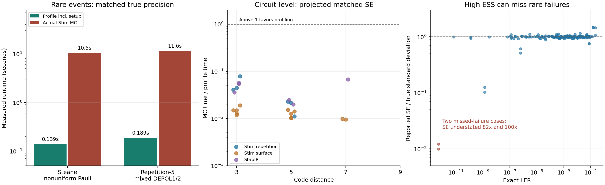

# Broader general-noise validation and Monte Carlo comparison

Local research results, September 16, 2026. The method has a demonstrated
advantage on selected rare-event examples. The current general-noise prototype
is slower than direct Stim Monte Carlo on the tested circuit-level workloads.
The tests also expose seriously overconfident sample standard errors when rare
failures inside a weight stratum are unobserved. These results do not justify
a universal speedup, universal accuracy, or a bug-free implementation claim.



## Experimental scope

* **42 exact-oracle configurations, 168 p comparisons.** Five-qubit,
  Steane, Shor, and repetition-3/5/7 codes crossed with seven noise families:
  uniform single-qubit depolarization; nonuniform biased single-qubit Paulis;
  mixed DEPOLARIZE1/2; biased PAULI_CHANNEL_2; correlated E/ELSE chains;
  heralded Pauli channels; and measurement-record noise. The checks use
  p=0.001, 0.01, 0.05, 0.15 with reference p0=0.05.
* **27 circuit-level configurations, 81 p comparisons.** Stim repetition
  distances 3/5/9; rotated Z surface distances 3/5/7; rotated X and unrotated Z
  surface distances 3/5; StabIR surface distances 3/5 and repetition 3/7.
  Stim circuits use rounds=distance; StabIR circuits use three rounds. Noise
  includes uniform single-qubit channels, nonuniform circuit-level depolarization,
  biased single-/two-qubit channels, SD6, and SI1000. This is a selected matrix,
  not the complete Cartesian product: distance-7 surface experiments use
  uniform-single and nonuniform-depolarizing noise in the Z memory basis.
* **210 additional replicate profiles** for SE calibration: 30 seeds per noise
  family on the five-qubit example at p=0.01. Seeds are reused across families,
  and p points from one profile share samples; do not treat all reported points
  as independent experiments.
* **901,814,188 actual Stim Monte Carlo shots**, including the matched-precision
  experiments and the two rare-point follow-ups. The original matrix uses one
  million MC shots per circuit point and 300,000 per exact-oracle point.

The exact oracle uses independent Pauli commutation and syndrome-state
convolution. It never calls the production noise parser, fault responses, or
enumerator. Unit tests compare every channel outcome's fault response and
Pauli weight directly against that independent calculation. The exact MC
circuits are also generated directly at each p instead of using the production
`circuit_at` scaling function. Code-capacity examples have ideal encoding and
syndrome extraction except in the named readout experiment. Their fixed lookup
decoder uses the exact distribution at p0; the heralded experiment ignores the
flags in decoding. Circuit-level experiments use a fixed PyMatching decoder
constructed at p=0.003. Approximate disjoint DEM conversion is used only to
define that decoder, never to sample noise in either method.
Weight remains the number of inserted single-qubit Pauli factors at their
original locations; XX has weight two. Record flips and heralded identity
outcomes have weight zero under this convention.

## Actual matched-precision advantage

At p=0.001, exact variance determines the ordinary MC sample count before the
experiment. We actually ran those shots; these two rows are not extrapolations.
Both methods use the same fixed decoder. Profile time includes circuit/model
construction, fault-response compilation, sampling, decoding, and evaluation;
MC time includes target-circuit/sampler construction, sampling, and decoding.
The common lookup decoder is used by both. Oracle calculations used solely for
validation and setting the MC budget are outside both timings.

| Code / noise | Profile shots | Profile time | Actual MC shots | MC time | Measured speedup |
|---|---:|---:|---:|---:|---:|
| steane / nonuniform_single | 40,000 | 0.139 s | 312,085,826 | 10.48 s | 75.4x |
| repetition_5 / mixed_depolarizing | 50,000 | 0.189 s | 438,328,362 | 11.56 s | 61.3x |

The Steane example has exact LER 1.5901718e-06 and matched true SE
7.1381333e-08; the repetition example has exact LER
3.3756925e-07 and matched true SE 2.7751188e-08.
The profiles simultaneously retain their entire estimated polynomial. These
are code-capacity examples, not evidence of the same speedup at circuit level.

## Circuit-level cost and accuracy limits

Of 81 matrix points, only 56 had at least 100 MC failures. The
remaining 25 provide weaker or inconclusive rare-event comparisons.
Across the 56 points where a precision-cost projection was usable,
profiling won 0 times. Projected MC/profile runtime ratios
ranged from 0.001136 to 0.215. Values below 1 favor direct MC.
These projections use the reported profile SE and measured MC throughput;
they are not experiments at every projected budget. An underestimated profile
SE can make profiling look better in this comparison, so these numbers do not
certify its uncertainty. A three-point polynomial sweep does not erase the
large setup/sampling cost on these tested circuits.

Follow-up MC at p=0.001, selected after observing sparse matrix discrepancies:

| Circuit | Profile estimate | Independent MC estimate | MC failures / shots |
|---|---:|---:|---:|
| stim_rotated_z_d5_biased_pauli | 1.39975e-06 | 1.22e-05 | 122 / 10,000,000 |
| stim_rotated_z_d7_nonuniform_depolarizing | 4.78954e-07 | 7.3e-06 | 73 / 10,000,000 |

These follow-ups are exploratory diagnostics, not a pre-registered multiple-test
significance analysis. They test the same fixed decoder. They must be retained
alongside favorable results rather than hidden by aggregate agreement counts.
Their minimum likelihood ESS values were approximately 3.90 and 1.04 out of
2000 per weight, warning of poor overlap. The exact examples below show a
different limitation: high ESS also cannot certify adequate failure sampling.

## A failure of the estimated SE, not of the expectation identity

For repetition-7 with nonuniform single-qubit noise at p=0.001, the exact LER
is 5.14473535e-13. The profile gives 1.07230110e-13 with reported SE 1.83216444e-14,
despite minimum ESS 4989.6 out of 5000. It observed no failures at weight 3.
The expected count of weight-3 failures in this budget is only 0.0774; observing
none has probability 92.6%. Those histories dominate the low-p answer.

The independent second-moment calculation finds true standard deviation
1.50724901e-12, about 82x the reported SE. The heralded variant understates SE
by about 100x. The corresponding point estimates are about 79% low in this
realization. The estimator is unbiased over repeated experiments: rare large
contributions restore its expectation. A typical small sample can still miss
those contributions and report a misleadingly small SE.

Across all 168 oracle comparisons, the largest discrepancy is 2.322
true standard deviations. This supports the mathematical estimator and fault
semantics, while the failed reported-SE checks expose inadequate uncertainty
diagnostics. The 210 replicate five-qubit profiles had 200/210 nominal 95%
normal intervals cover truth; that aggregate result does not protect the
repetition-7 rare-failure examples.

`profile.confidence_bounds(p)` now adds a conservative fixed-budget pointwise
interval using an exact maximum-likelihood-ratio DP and a two-sided empirical
Bernstein bound. It covers both counterexamples but is extremely loose: the
upper endpoints are approximately 0.0030173 and
0.0033547, versus true LER near 5e-13. It exposes insufficient
information; it does not repair the estimate or certify useful rare-event
precision. See [the derivation](general_noise_math.md#finite-sample-confidence-and-missed-failures).

## Reproduction and verification

```
python benchmark/general_noise_oracles.py
python benchmark/general_noise_matrix.py
python -c "import json; from benchmark.general_noise_matrix import OUT, confirm_rare_points; (OUT/'rare_point_followup.json').write_text(json.dumps(confirm_rare_points(), indent=2))"
python benchmark/summarize_general_noise_validation.py
```

The complete suite passed **810 tests, two existing skips**. All **80 new
oracle/uncertainty tests** also passed under Stim 1.16. Coverage is 100% for the
new confidence module, 100% for polynomial export, and 97% for general-noise
profiling. Tests were run locally on Windows; remote CI has not been run.
The local Python 3.14 coverage run needed numerical dependencies imported before
starting coverage because otherwise NumPy raised a duplicate extension-load
error; tests without coverage and the separate Stim 1.16 environment passed.

Timings are observations from a shared development machine with other processes
running, not isolated hardware benchmarks. They establish the observed regimes,
not portable speedup constants. The new experiments exercise the Python+Stim
general-noise path. Existing native propagation/sampling audits and the full
suite also pass, but this is not a new exhaustive audit of every C++ path.
Recorded matrix execution errors: None.

## What the evidence supports, and what needs work

The finite-history reweighting identity is exact for the documented supported
noise family and a fixed decoder. Finite tests cannot prove that all code is
bug-free. Generality here means supported classical Pauli/record noise with
probabilities proportional to one p (including conditional ELSE probabilities),
not arbitrary coherent, non-Pauli, or unrestricted non-Markovian noise. This
study does not validate every Stim program or large LDPC code family.

The next statistical improvement should allocate samples to rare likelihood
groups within each Pauli weight, using additional activation/rate information.
Post-sampling compression already records that information but does not ensure
those groups were sampled. Independent pilot and production budgets can support
allocation without silently invoking invalid optional-stopping guarantees.
The next performance improvement should target conditional sampling and bulk
fault-response compilation, which dominate the larger circuit runs. Faster
polynomial evaluation alone does not solve either bottleneck. The extension
remains experimental and has not been published as a validated general solver.

## Complete circuit matrix

The final column projects MC/profile runtime at p=0.01 for the same reported SE.
NaN means too few MC failures for that comparison, not zero cost or zero LER.

| Configuration | Rounds | Noise locations | Profile trials | Profile total | MC/profile ratio |
|---|---:|---:|---:|---:|---:|
| stim_repetition_d3_uniform_single | 3 | 53 | 34,000 | 0.68 s | 0.0408 |
| stim_repetition_d3_nonuniform_depolarizing | 3 | 41 | 34,000 | 0.69 s | 0.0444 |
| stim_repetition_d3_biased_pauli | 3 | 41 | 34,000 | 0.58 s | 0.0787 |
| stim_repetition_d5_uniform_single | 5 | 159 | 34,000 | 3.09 s | 0.0230 |
| stim_repetition_d5_nonuniform_depolarizing | 5 | 119 | 50,000 | 3.33 s | 0.0215 |
| stim_repetition_d5_biased_pauli | 5 | 119 | 50,000 | 4.95 s | 0.0112 |
| stim_repetition_d9_uniform_single | 9 | 539 | 74,000 | 14.08 s | nan |
| stim_repetition_d9_nonuniform_depolarizing | 9 | 395 | 74,000 | 16.80 s | nan |
| stim_repetition_d9_biased_pauli | 9 | 395 | 74,000 | 12.29 s | nan |
| stim_rotated_z_d3_uniform_single | 3 | 269 | 50,000 | 3.61 s | 0.0149 |
| stim_rotated_z_d3_nonuniform_depolarizing | 3 | 197 | 50,000 | 3.17 s | 0.0150 |
| stim_rotated_z_d3_biased_pauli | 3 | 197 | 50,000 | 3.07 s | 0.0190 |
| stim_rotated_z_d5_uniform_single | 5 | 1359 | 110,000 | 50.15 s | 0.0153 |
| stim_rotated_z_d5_nonuniform_depolarizing | 5 | 959 | 110,000 | 43.45 s | 0.0104 |
| stim_rotated_z_d5_biased_pauli | 5 | 959 | 110,000 | 44.14 s | 0.0142 |
| stim_rotated_z_d7_uniform_single | 7 | 3849 | 246,000 | 403.10 s | 0.0099 |
| stim_rotated_z_d7_nonuniform_depolarizing | 7 | 2673 | 246,000 | 269.07 s | 0.0096 |
| stim_rotated_x_d3_nonuniform_depolarizing | 3 | 197 | 50,000 | 5.66 s | 0.0129 |
| stim_rotated_x_d5_nonuniform_depolarizing | 5 | 959 | 110,000 | 66.30 s | 0.0127 |
| stim_unrotated_z_d3_nonuniform_depolarizing | 3 | 305 | 74,000 | 9.03 s | 0.0119 |
| stim_unrotated_z_d5_nonuniform_depolarizing | 5 | 1647 | 164,000 | 117.99 s | 0.0102 |
| stabir_surface_d3_SD6 | 3 | 153 | 50,000 | 2.84 s | 0.0359 |
| stabir_surface_d3_SI1000 | 3 | 207 | 50,000 | 5.17 s | 0.0540 |
| stabir_surface_d5_SD6 | 3 | 481 | 74,000 | 16.73 s | 0.0246 |
| stabir_surface_d5_SI1000 | 3 | 631 | 110,000 | 19.62 s | 0.0200 |
| stabir_repetition_d3_SI1000 | 3 | 45 | 34,000 | 0.45 s | 0.0575 |
| stabir_repetition_d7_SI1000 | 3 | 121 | 50,000 | 1.91 s | 0.0676 |
