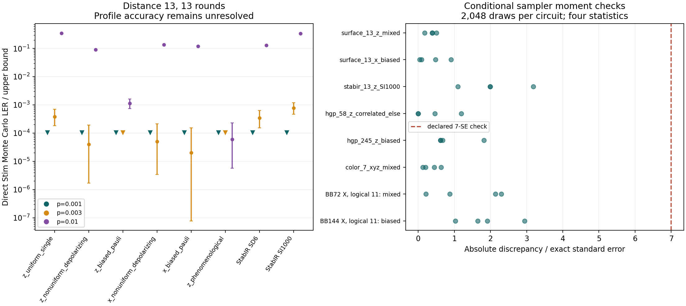

# Distance-13 and QLDPC validation

Local research validation, September 16, 2026. This study increases the tested
sizes and uses independent fault-level checks, not just agreement between two
estimated error rates. It does **not** establish that the implementation is
bug-free, generally efficient, or accurate on every tested large circuit.

All **56** main configurations reached a terminal outcome: **51 completed,
three timed out, and two failed with numerical underflow**. They retain
9,498,400 direct Monte Carlo shots at 157 completed reference points. Only
two main profiles met the requested accuracy within their budgets: HGP58
uniform-single and correlated-ELSE noise. An additional independent bounded
reference confirms three of their six p points to 10%; the other three
reference enclosures are too wide to decide. No interval contradiction was found.

The principal negative result is that the distance-13 profiles did not meet
the requested 10% accuracy in the allotted profiling budget. A zero estimate
with a wide interval is unresolved, not a successful low-LER calculation.
The larger bicycle runs also exposed a conditional-probability underflow limit.

A separate **five-minute** d13 nonuniform-depolarization follow-up reached
13,568 samples in 306.7 seconds and still failed the accuracy target. At p=0.01,
its raw estimate was zero with interval [0,1], whereas direct Stim Monte Carlo
observed 9,004 failures in 100,000 shots: LER 0.09004, with the matrix-adjusted
interval [0.08645,0.09372]. The latter point took about 69 seconds of MC sampling
and decoding. These are not matched whole-grid timing comparisons, but they
clearly expose a practical failure of the current automatic profiler.

The follow-up sampled only weights 8–28: allocation concentrated on the lowest-p
part of the requested grid, leaving the high-p region unresolved. The allocation
policy needs attention alongside sampling speed and stable arithmetic. Increasing
the sample budget alone did not produce a useful curve in this test. No zero
polynomial from this run is certified or suitable as a final LER result.

[Recorded results and every incomplete case](../experiment_results/large_code_validation/results.md)
are generated from the raw JSON records. The
[machine-readable summary](../experiment_results/large_code_validation/summary.json)
and [all completed comparisons](../experiment_results/large_code_validation/comparisons.csv)
include negative outcomes.



Downward triangles in the left panel are Monte Carlo upper bounds after zero
observed failures, not zero LER. Its error bars use the matrix-wide confidence
allocation described below. The right panel concerns sampling-law diagnostics,
not logical-error-rate accuracy.

## Scope

The 56-case matrix was declared before its estimates were examined. It is a
selected matrix, not all possible codes, circuits, noise models, or combinations.

| Family | Sizes / distances | Noise and measurement scope |
|---|---|---|
| Stim rotated surface | Z memory d=3,5,7,9,11,13; X memory d=3,7,13; rounds=d | Uniform single-qubit gate channels, nonuniform DEPOLARIZE1/2, biased PAULI_CHANNEL_1/2; d13 Z additionally E/ELSE and phenomenological noise |
| StabIR surface | d=3,7,13; rounds=d | SD6 and SI1000, compiled through the repository's StabIR frontend |
| Stim color | d=3,5,7; rounds=d | Nonuniform circuit noise, including two-qubit depolarization |
| CSS hypergraph product (HGP) | n=58,180,245; k=16,36,49 | Four noise families; code-capacity Z memory with ideal preparation and syndrome measurements; all k logical outputs |
| Stored bivariate bicycle (BB) circuits | [[72,12,6]], [[90,8,10]], [[108,8,8]], [[144,12,12]], [[288,16,18]]; respectively 18,30,24,36,54 rounds | Nonuniform / biased noise except BB90 biased only. BB72–144 use circuit noise. BB288 has data-readout noise only. Each stored circuit defines just one logical observable. |

The HGP construction is explicitly formed over GF(2):

\[
H_X=[H\otimes I_n\mid I_m\otimes H^T],\qquad
H_Z=[I_n\otimes H\mid H^T\otimes I_m].
\]

Tests check commutation, ranks, sparsity, and independent logical operators.
The actual classical matrices are retained in the case records. No new code
distance is claimed for these HGP instances. The BB n,k,d values are the
repository fixture labels, not independent distance proofs; see the
[bivariate bicycle construction paper](https://arxiv.org/abs/2308.07915) for
the family, not as a validation of these particular stored files.

### Important fixture and model qualifications

* The BB files contain only `OBSERVABLE_INCLUDE(k-1)`. Stim's `num_observables=k`
  describes the output vector width; the preceding k−1 slots are empty. Their
  LER is a **single-logical** error probability, not the full code's block LER.
  HGP, by contrast, measures every constructed logical output and uses block failure.
* The BB fixtures are **X-memory** schedules (H then M on final data readout).
  Historical case identifiers retain `bicycle_*_z_*` so saved attempts remain
  traceable; that token does not describe their physical basis.
* BB288 retains its full stored schedule but places noise only on data qubits
  immediately before M in final readout. It is not evidence for full circuit
  noise on the [[288,16,18]] code.
* `uniform_single` means uniform DEPOLARIZE1 gate channels. Circuit-level cases
  also have reset faults at 0.5p and measurement-record flips at 2p. HGP's
  uniform case really is uniform data-only single-qubit depolarization.
* Nonuniform location coefficients cycle through 0.25, 1, and 2. The biased
  single-qubit channel is 95% Z; the pair channel has enhanced XX and ZZ.
  Correlated channels include `E(0.8*c*p)` followed by conditional
  `ELSE_CORRELATED_ERROR(0.5*c*p)`. The latter has an unconditional history
  probability containing both p and survival factors.
* Weight is the number of inserted Pauli factors at noise locations. It is
  neither the number of activated channels nor the final residual Pauli weight.

## Independent checks

### Actual histories, not just mean LER

An independent parser reads the original Stim noise instructions. For each
completed audit it checks every factor's outcome probabilities at three p values,
draws actual low- and typical-weight histories from the production sampler,
and replaces their noise by explicit Pauli gates in a fresh Stim circuit.
Every detector bit and every logical-output bit must match. It also verifies
the actual Pauli weight and recomputes the complete history likelihood ratio
without using the production K,M statistics.

HGP cases additionally check **every** single-location outcome column by CSS
commutation, independently of Stim response compilation. This tests temporal
and logical behavior that an aggregate LER comparison can miss.

The legacy C++ sampler is checked separately on distance-13 X/Z surface
memories and the defined logical observable in BB72/144. All 64 actual native
histories at weights 0,1,2,13 matched independent Stim replay. The returned
fault vectors and hashes of the output bits are saved, since that native API
does not expose a seed. These SID tests do not establish a native implementation
of the general-noise estimator or a full-block BB result.

### Conditional sampling probabilities

Eight large-circuit cases receive 2,048 conditional draws each (16,384 total).
An independent generating-function calculation supplies exact conditional
means and variances for four history statistics: activated locations,
early-half activations, two-Pauli outcomes, and single-X outcomes.
The largest observed mean discrepancy was 3.186 true standard errors; all
passed the declared 7-SE diagnostic. A separate exhaustive tiny-circuit test
checks the moment calculation itself. These selected moments do not prove
the entire joint sampling distribution correct.

### A bounded reference stronger than Monte Carlo agreement

For HGP58 at p=0.00005,0.0001,0.0002, an independent oracle enumerates all
histories of Pauli weight at most two, using CSS algebra and original channel
probabilities. The omitted probability is accumulated positively. Thus

\[
L_{\leq2}(p)\leq L(p)\leq L_{\leq2}(p)+\Pr_p(W>2).
\]

These bounds are deterministic apart from floating-point arithmetic and
assume the declared fixed decoder. They do not use the production sampler's
estimated variance. There are four noise families and two decoder variants:

* The matrix's baseline is BP+OSD0, min-sum, 30 BP iterations. It fails 17 of
  174 single-Pauli histories in the uniform HGP58 case. This is a property of
  that decoder and makes that particular validation unusually easy.
* The supplementary variant is BP+OSD4 with product-sum BP and an independent
  CSS lookup that corrects every single-Pauli history. It is explicitly a
  different fixed decoder, used identically by the oracle and profiler.

Seven of the eight profiles met their requested accuracy at all three points;
23 of 24 point estimates were independently verified to 10% by the whole
oracle enclosure. Strong-decoder nonuniform depolarization remained unresolved
at p=0.0002. Its oracle interval was approximately [0.00042118,0.00048379].
The unresolved case is retained, not retuned away.

The automatic profiler itself used substantial exact enumeration in these
successful cases (up to 60,379 histories), as well as random samples. This is
evidence for the combined automatic procedure, **not** evidence that weighted
sampling alone is efficient at all QLDPC sizes.

One concrete polynomial check is the stronger-decoder HGP58 uniform-data case.
All weight-zero/one histories are corrected and exactly 865 weight-two Pauli
histories fail. Its computed low-weight contribution is

\[
L_{\leq2}(p)=\frac{865}{9}p^2(1-p)^{56},\qquad
0\leq L(p)-L_{\leq2}(p)\leq
\sum_{w=3}^{58}\binom{58}{w}p^w(1-p)^{58-w}.
\]

At p=10^-4 this encloses LER in [9.55744e-7,9.86473e-7]. The same computed
polynomial is used at all three p values; it is a bounded partial polynomial,
not the exact full LER polynomial. This is an informative rare-error validation
that does not depend on observing rare failures in ordinary Monte Carlo.

## Monte Carlo and stopping protocol

Each main case constructs one model from its circuit at p0=0.01 and requests
one reusable profile for p=0.001,0.003,0.01. The decoder is fixed at p=0.003:
PyMatching for ordinary surface/StabIR cases; BP+OSD0 for HGP, BB, color, and
E/ELSE cases. Decoder sample-order invariance is checked. BP+OSD uses an
approximate-disjoint DEM to construct its decoder; **actual sampling** uses
the original Stim channels, preserving their exclusivity and correlations.
The decoder implementation is [stimbposd](https://github.com/oscarhiggott/stimbposd).

The profile request is 10% relative error, no absolute allowance, 99%
simultaneous confidence on its three-point grid, 300,000 random shots maximum,
100,000 exact histories maximum, and a 30-second profiling time budget.
The time limit is checked between batches and can be exceeded by a batch or
exact enumeration. Each whole case has a separate 600-second process cap.
Compilation, fault replay, and direct Monte Carlo are additional work.

Independent direct Stim Monte Carlo uses, **per p**, 100,000 shots for
surface/StabIR; 4,096 for HGP/color; 1,024 for BB72/288; and 256 for BB90/108/144.
Each target circuit is rebuilt directly at p without calling the production
scaling helper. It must also agree with that helper's result.

Monte Carlo intervals are exact binomial Clopper–Pearson intervals, with
alpha=0.01/(56×3) per point, giving at least 99% simultaneous coverage for
the predeclared set of MC references. Profile confidence is per profile;
we do not claim that 56 separate 99% profile intervals jointly have 99% coverage.

An overlapping profile/MC interval is only a consistency check. When the
profile interval is nearly [0,1], it is essentially uninformative. A Monte Carlo
reference verifies a 10% point-estimate claim only when its entire interval
is inside [estimate/1.1, estimate/0.9]. No-failure Monte Carlo runs provide
upper limits. None of these comparisons establishes a universal speed advantage.

## Bugs fixed and limitations retained

The expanded work reproduced two legacy output-contract bugs in both Python
and C++: repeated `OBSERVABLE_INCLUDE(0)` statements overwrote rather than
XOR-accumulated contributions, and different logical IDs silently collapsed
to a single output. Duplicate detector records also needed parity reduction.
Parity handling is fixed and regression-tested. The legacy single-output
backends now **reject nonzero logical IDs explicitly**. Use the general-noise
path for multiple outputs; this is an intentional compatibility restriction
instead of a silently incorrect result.

Response compilation now has a faster binary fault-explanation path, checked
bit-for-bit against independently forced Stim simulation on the small-code and
circuit-level test matrix. It makes d13 feasible to compile locally (about
32 seconds in a representative run). MPAD and heralded channels retain the
forced-simulation path: Stim 1.15 explanations were found to omit MPAD noise.
This optimization changes how signatures are found, not the sampled noise law.

The general-noise low-weight audit on BB144 failed because the conditional
normalizer at p0 underflowed. A strictly positive subnormal floating-point
number can also have insufficient relative precision. New circuit-size-dependent
guards reject severely under-resolved normalizers rather than return unreliable
draws, and automatic proposal selection excludes them. Well-resolved tiny
single-location examples remain supported. A 1,070-site Bernoulli regression reproduces this
limit cheaply. **A stable logarithmic or tilted conditional sampler is still
needed to extend this regime; the guard is not a numerical solution.**

The detailed discovery log, including the initially mis-specified BB native
projection, is retained in
[audit_discoveries.json](../experiment_results/large_code_validation/audit_discoveries.json).
The initial failed attempts remain in the result set. These findings are why
“many tests passed” must not be translated into “all codes and noise are correct.”

## Reproduction and regression checks

From the repository root, with the package and its `ldpc` extra installed:

```text
python -m benchmark.large_code_validation --workers 2 --timeout 600 --resume
python -m benchmark.conditional_moment_audit
python -m benchmark.hgp_bounded_oracle
python -m benchmark.hgp_bounded_oracle --strong
python -m benchmark.native_large_fault_audit
python -m benchmark.longer_distance13_budget
python -m benchmark.verify_accepted_profiles
python -m benchmark.summarize_large_validation
```

`--resume` skips existing case records, including failures; it does not cherry-pick
successful reruns. Run a fresh study in a fresh output directory or preserve
earlier artifacts before explicitly rerunning a case. Per-case seeds, circuit
hashes, dependency versions, sample counts, intermediate phases, and errors
are retained. Large generated Stim files and logs are local outputs; generators
and hashes make the circuits reproducible without committing those large files.

The production changes have regression coverage against both supported Stim
1.15 and 1.16 installations. CI installs the optional LDPC decoder for its
tests and includes the new response-compiler and QLDPC regressions in the
95% estimator-module coverage gate. Native parser tests are included in the
existing sanitizer CI job; local CMake tests passed on Windows without
claiming that a Linux sanitizer job was run locally.

The final full local suite passed **922 tests with two pre-existing skips**,
including 61 new regressions. Line coverage was 97.03% for `general_noise.py`,
96.72% for `adaptive.py`, and 100% for `confidence.py` and
`noise_polynomial.py`. Whole-package coverage was 53.31%; this is not a claim
that every legacy module is thoroughly tested. The Stim 1.16 compatibility
subset passed 153 tests with one optional-decoder skip, with additional
precision-boundary and adaptive tests after the numerical-guard change.

The next justified development priorities are allocation that serves the full
p grid, stable conditional arithmetic, lower-cost sampling across many circuit
locations, and informative certified intervals on the large benchmarks. Publishing the general-noise extension as
universally validated or generally faster would be premature.
