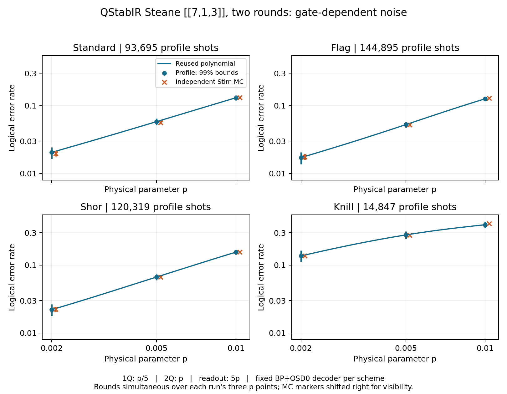

# QStabIR example verification

All four runs met 25% relative error at 99% per-run simultaneous confidence.
Each was compared to 50,000 independent Stim shots per p (600,000 total).
All 12 pairs of confidence intervals overlap. This is not a proof of universal accuracy.

| Scheme | p | Profile LER | Stim MC LER | Profile shots (whole curve) |
|---|---:|---:|---:|---:|
| Standard | 0.002 | 0.0204620 | 0.0196600 | 93,695 |
| Standard | 0.005 | 0.0580736 | 0.0563200 | 93,695 |
| Standard | 0.01 | 0.1305150 | 0.1310800 | 93,695 |
| Flag | 0.002 | 0.0171410 | 0.0175800 | 144,895 |
| Flag | 0.005 | 0.0525015 | 0.0522400 | 144,895 |
| Flag | 0.01 | 0.1262442 | 0.1289200 | 144,895 |
| Shor | 0.002 | 0.0220152 | 0.0224200 | 120,319 |
| Shor | 0.005 | 0.0666891 | 0.0669200 | 120,319 |
| Shor | 0.01 | 0.1547983 | 0.1550400 | 120,319 |
| Knill | 0.002 | 0.1363183 | 0.1371400 | 14,847 |
| Knill | 0.005 | 0.2780660 | 0.2758600 | 14,847 |
| Knill | 0.01 | 0.3930515 | 0.4098000 | 14,847 |

Exact intervals, decoder settings, seeds and status are in each scheme's results.json.
Saved NPZ polynomials reproduce the profile point estimates. Timing is not a controlled speed comparison.

